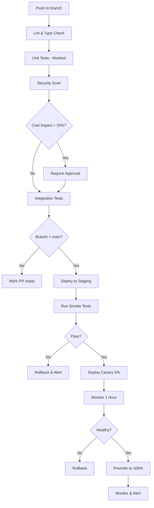

# CI/CD for AI Systems

Continuous Integration and Continuous Deployment patterns for AI/agentic applications.

## Table of Contents

1. [CI/CD for AI vs Traditional Apps](#differences)
2. [Testing Pipelines](#testing-pipelines)
3. [Automated Quality Gates](#quality-gates)
4. [Deployment Automation](#deployment-automation)
5. [Rollback Strategies](#rollback)
6. [Monitoring & Alerts](#monitoring)

---

<a name="differences"></a>
## 1. CI/CD for AI vs Traditional Apps

### 1.1 Key Differences

| Aspect | Traditional App | AI Application |
|--------|-----------------|----------------|
| **Testing** | Deterministic unit tests | Probabilistic outputs, harder to test |
| **Versioning** | Code only | Code + prompts + models |
| **Rollback** | Simple code revert | Must coordinate prompt/model/code |
| **Cost** | Compute resources | API costs per test run |
| **Performance** | CPU/memory metrics | Quality/accuracy metrics |

### 1.2 Special Considerations

```markdown
## AI-Specific CI/CD Challenges

### Challenge 1: Non-Deterministic Outputs
**Problem:** Same input → different outputs (due to temperature > 0)
**Solution:**
- Use temperature=0 for tests
- Test for output structure, not exact text
- Use LLM-as-judge for quality checks

### Challenge 2: Expensive Tests
**Problem:** Running LLM calls in CI costs money
**Solution:**
- Mock LLM responses for unit tests
- Use cheaper models (Haiku) for CI
- Limit integration tests to critical paths
- Cache test results

### Challenge 3: Slow Tests
**Problem:** LLM calls add latency (1-5s each)
**Solution:**
- Parallel test execution
- Smart test selection
- Batch API calls
- Use faster models for CI

### Challenge 4: Prompt Changes
**Problem:** Hard to test prompt changes systematically
**Solution:**
- Prompt regression test suite
- A/B testing framework
- Gradual rollouts
```

---

<a name="testing-pipelines"></a>
## 2. Testing Pipelines

### 2.1 Basic GitHub Actions Pipeline

```yaml
# .github/workflows/ci.yml
name: AI Agent CI

on: [push, pull_request]

env:
  ANTHROPIC_API_KEY: ${{ secrets.ANTHROPIC_API_KEY }}

jobs:
  lint:
    runs-on: ubuntu-latest
    steps:
      - uses: actions/checkout@v3

      - name: Set up Python
        uses: actions/setup-python@v4
        with:
          python-version: '3.11'

      - name: Install dependencies
        run: |
          pip install flake8 mypy black
          pip install -r requirements.txt

      - name: Lint with flake8
        run: flake8 src/ --max-line-length=100

      - name: Type check with mypy
        run: mypy src/

      - name: Format check with black
        run: black --check src/

  test:
    runs-on: ubuntu-latest
    steps:
      - uses: actions/checkout@v3

      - name: Set up Python
        uses: actions/setup-python@v4
        with:
          python-version: '3.11'

      - name: Install dependencies
        run: pip install -r requirements.txt

      - name: Run unit tests (with mocks)
        run: pytest tests/unit/ -v --cov=src

      - name: Run integration tests (with real LLM)
        run: |
          # Use cheap model for CI
          export TEST_MODEL=claude-3-haiku-20240307
          pytest tests/integration/ -v --maxfail=3
        env:
          ANTHROPIC_API_KEY: ${{ secrets.ANTHROPIC_API_KEY }}

  security:
    runs-on: ubuntu-latest
    steps:
      - uses: actions/checkout@v3

      - name: Check for secrets
        run: |
          # Fail if API keys are committed
          if grep -r "sk-ant-" src/ tests/; then
            echo "Error: API key found in code"
            exit 1
          fi

      - name: Security scan
        run: |
          pip install bandit safety
          bandit -r src/
          safety check

  cost-check:
    runs-on: ubuntu-latest
    steps:
      - uses: actions/checkout@v3

      - name: Estimate cost impact
        run: |
          python scripts/estimate_cost_impact.py
          # Fails if cost increase > 20% without approval

  prompt-regression:
    runs-on: ubuntu-latest
    steps:
      - uses: actions/checkout@v3

      - name: Run prompt regression tests
        run: |
          # Test prompts against known good outputs
          pytest tests/prompts/ -v
        env:
          ANTHROPIC_API_KEY: ${{ secrets.ANTHROPIC_API_KEY }}
```

### 2.2 Multi-Stage Pipeline

```yaml
# .github/workflows/full-pipeline.yml
name: Full CI/CD Pipeline

on:
  push:
    branches: [main, develop]
  pull_request:
    branches: [main, develop]

jobs:
  # Stage 1: Fast Checks (< 2 min)
  quick-checks:
    runs-on: ubuntu-latest
    steps:
      - uses: actions/checkout@v3
      - name: Lint
        run: flake8 src/
      - name: Type check
        run: mypy src/
      - name: Security scan
        run: bandit -r src/

  # Stage 2: Unit Tests (< 5 min)
  unit-tests:
    needs: quick-checks
    runs-on: ubuntu-latest
    steps:
      - uses: actions/checkout@v3
      - name: Run unit tests (mocked LLM)
        run: pytest tests/unit/ -v --cov=src --cov-report=xml

      - name: Upload coverage
        uses: codecov/codecov-action@v3

  # Stage 3: Integration Tests (< 10 min)
  integration-tests:
    needs: unit-tests
    runs-on: ubuntu-latest
    steps:
      - uses: actions/checkout@v3
      - name: Run integration tests (real LLM, cheap model)
        run: |
          export TEST_MODEL=claude-3-haiku-20240307
          pytest tests/integration/ -v
        env:
          ANTHROPIC_API_KEY: ${{ secrets.ANTHROPIC_API_KEY }}

  # Stage 4: Quality Gates (< 5 min)
  quality-gates:
    needs: integration-tests
    runs-on: ubuntu-latest
    steps:
      - uses: actions/checkout@v3

      - name: Cost impact check
        run: python scripts/cost_impact.py

      - name: Performance benchmarks
        run: python scripts/benchmark.py

      - name: Prompt regression tests
        run: pytest tests/prompts/ -v

  # Stage 5: Deploy (only on main branch)
  deploy:
    needs: quality-gates
    if: github.ref == 'refs/heads/main'
    runs-on: ubuntu-latest
    steps:
      - uses: actions/checkout@v3

      - name: Deploy to Railway
        run: |
          npm install -g @railway/cli
          railway up --service production-agent
        env:
          RAILWAY_TOKEN: ${{ secrets.RAILWAY_TOKEN }}

      - name: Run smoke tests
        run: |
          sleep 10  # Wait for deployment
          python scripts/smoke_tests.py https://production-agent.railway.app

      - name: Notify team
        uses: slackapi/slack-github-action@v1
        with:
          payload: |
            {
              "text": "✅ Production deployment successful: ${{ github.sha }}"
            }
        env:
          SLACK_WEBHOOK_URL: ${{ secrets.SLACK_WEBHOOK }}
```

### 2.3 Cost-Aware Testing

```python
# scripts/cost_impact.py
"""Estimate cost impact of changes in CI/CD."""
import subprocess
import json

def estimate_cost_impact():
    """Estimate cost impact before merging."""

    # Run benchmark tests
    result = subprocess.run(
        ["pytest", "tests/benchmarks/", "--json-report"],
        capture_output=True,
        text=True
    )

    # Parse results
    with open(".report.json") as f:
        report = json.load(f)

    # Calculate costs
    current_cost = report["current_branch_cost"]
    baseline_cost = report["main_branch_cost"]

    cost_increase_pct = ((current_cost - baseline_cost) / baseline_cost) * 100

    print(f"Cost Impact Analysis:")
    print(f"  Baseline (main): ${baseline_cost:.4f} per test run")
    print(f"  Current (PR): ${current_cost:.4f} per test run")
    print(f"  Impact: {cost_increase_pct:+.1f}%")

    # Fail if cost increase > 20% without approval
    if cost_increase_pct > 20:
        # Check if there's a cost approval label
        if "cost-increase-approved" not in get_pr_labels():
            print("❌ Cost increase > 20% requires approval")
            print("Add 'cost-increase-approved' label to PR")
            exit(1)

    print("✅ Cost impact acceptable")

if __name__ == "__main__":
    estimate_cost_impact()
```

---

<a name="quality-gates"></a>
## 3. Automated Quality Gates

### 3.1 Prompt Regression Testing

```python
# tests/prompts/test_code_review_prompt.py
"""
Regression tests for prompts.

Test that prompt changes don't degrade quality on known examples.
"""
import pytest
from src.prompts import get_code_review_prompt
from src.llm_client import LLMClient

# Golden test cases with expected behaviors
GOLDEN_CASES = [
    {
        "code": "def query(id): return f'SELECT * FROM users WHERE id={id}'",
        "expected_issues": ["SQL injection"],
        "severity": "high"
    },
    {
        "code": "def add(a, b): return a + b",
        "expected_issues": [],
        "severity": None
    },
    {
        "code": "<div>{user_input}</div>",
        "expected_issues": ["XSS vulnerability"],
        "severity": "high"
    }
]

@pytest.mark.integration
class TestCodeReviewPromptRegression:
    """Test that prompt changes maintain quality."""

    def test_sql_injection_detection(self, llm_client):
        """Prompt should always detect SQL injection."""
        prompt = get_code_review_prompt("latest")

        result = llm_client.review_code(
            GOLDEN_CASES[0]["code"],
            system_prompt=prompt
        )

        # Check that SQL injection is detected
        assert "sql injection" in result.lower(), \
            "Prompt regression: SQL injection not detected"

        assert result.severity == "high", \
            "Prompt regression: Severity should be high"

    def test_false_positives(self, llm_client):
        """Prompt should not flag correct code."""
        prompt = get_code_review_prompt("latest")

        result = llm_client.review_code(
            GOLDEN_CASES[1]["code"],
            system_prompt=prompt
        )

        # Should have no issues
        assert len(result.issues) == 0, \
            "Prompt regression: False positive on correct code"

    def test_xss_detection(self, llm_client):
        """Prompt should detect XSS vulnerabilities."""
        prompt = get_code_review_prompt("latest")

        result = llm_client.review_code(
            GOLDEN_CASES[2]["code"],
            system_prompt=prompt
        )

        assert "xss" in result.lower(), \
            "Prompt regression: XSS not detected"
```

### 3.2 Performance Gates

```python
# scripts/benchmark.py
"""Performance benchmarking for CI/CD gates."""
import time
import statistics
from src.agent import ProductionAgent

def benchmark_agent():
    """Benchmark agent performance."""
    agent = ProductionAgent()

    # Test queries
    queries = [
        "Simple query",
        "Medium complexity query with context",
        "Very complex query requiring deep analysis and reasoning"
    ]

    latencies = []
    costs = []

    for query in queries:
        start = time.time()
        result = agent.process(query)
        latency = (time.time() - start) * 1000

        latencies.append(latency)
        costs.append(result["cost"])

    # Calculate metrics
    p50 = statistics.median(latencies)
    p95 = statistics.quantiles(latencies, n=20)[18]  # 95th percentile
    avg_cost = statistics.mean(costs)

    print(f"Performance Benchmarks:")
    print(f"  P50 latency: {p50:.0f}ms")
    print(f"  P95 latency: {p95:.0f}ms")
    print(f"  Average cost: ${avg_cost:.4f}")

    # Gates
    assert p95 < 5000, f"❌ P95 latency too high: {p95:.0f}ms > 5000ms"
    assert avg_cost < 0.05, f"❌ Average cost too high: ${avg_cost:.4f} > $0.05"

    print("✅ All performance benchmarks passed")

if __name__ == "__main__":
    benchmark_agent()
```

### 3.3 LLM-as-Judge Quality Gate

```python
# tests/quality/test_output_quality.py
"""Use LLM to judge output quality in CI."""
import pytest
from src.agent import ProductionAgent

class OutputQualityJudge:
    """LLM-as-judge for output quality."""

    def __init__(self, llm_client):
        self.llm = llm_client

    def judge_quality(self, input_query: str, output: str) -> dict:
        """Judge output quality."""
        judge_prompt = f"""
        Evaluate this AI system's output on a scale of 1-10:

        Input: {input_query}

        Output: {output}

        Evaluate:
        1. Correctness (is it factually correct?)
        2. Completeness (answers the full question?)
        3. Clarity (easy to understand?)
        4. Relevance (stays on topic?)

        Return JSON:
        {{
            "correctness": 1-10,
            "completeness": 1-10,
            "clarity": 1-10,
            "relevance": 1-10,
            "overall": 1-10,
            "reasoning": "explanation"
        }}
        """

        result = self.llm.chat([{"role": "user", "content": judge_prompt}])
        return json.loads(result)

@pytest.mark.integration
def test_output_quality_gate(llm_client, agent):
    """Quality gate: outputs must score > 7/10 overall."""
    judge = OutputQualityJudge(llm_client)

    test_cases = [
        "Explain what a REST API is",
        "Review this code for security issues: ...",
        "Suggest improvements to this function: ..."
    ]

    for query in test_cases:
        output = agent.process(query)["response"]
        quality = judge.judge_quality(query, output)

        assert quality["overall"] >= 7, \
            f"Quality too low ({quality['overall']}/10): {quality['reasoning']}"
```

---

<a name="deployment-automation"></a>
## 4. Deployment Automation

### 4.1 Automated Deployment to Railway

```yaml
# .github/workflows/deploy-production.yml
name: Deploy to Production

on:
  push:
    branches: [main]
    tags: ['v*']

jobs:
  deploy:
    runs-on: ubuntu-latest
    environment: production  # Requires approval

    steps:
      - uses: actions/checkout@v3

      - name: Deploy to Railway
        run: |
          npm install -g @railway/cli
          railway up --service production-agent --detach
        env:
          RAILWAY_TOKEN: ${{ secrets.RAILWAY_TOKEN }}

      - name: Wait for deployment
        run: sleep 30

      - name: Run smoke tests
        run: |
          python scripts/smoke_tests.py https://production-agent.railway.app
        env:
          SMOKE_TEST_API_KEY: ${{ secrets.API_KEY }}

      - name: Monitor for 5 minutes
        run: |
          python scripts/monitor_deployment.py \
            --duration 300 \
            --error-threshold 0.05
        continue-on-error: true

      - name: Rollback if failed
        if: failure()
        run: |
          echo "Deployment failed, rolling back..."
          railway rollback
          exit 1

      - name: Notify team
        uses: slackapi/slack-github-action@v1
        with:
          payload: |
            {
              "text": "${{ job.status == 'success' && '✅' || '❌' }} Production deployment ${{ job.status }}: ${{ github.sha }}"
            }
        env:
          SLACK_WEBHOOK_URL: ${{ secrets.SLACK_WEBHOOK }}
```

### 4.2 Canary Deployment

```yaml
# .github/workflows/canary-deploy.yml
name: Canary Deployment

on:
  workflow_dispatch:
    inputs:
      version:
        description: 'Version to deploy'
        required: true

jobs:
  canary:
    runs-on: ubuntu-latest
    steps:
      - uses: actions/checkout@v3

      - name: Deploy canary (5% traffic)
        run: |
          # Update environment variable to route 5% of traffic
          railway variables set CANARY_VERSION=${{ github.event.inputs.version }}
          railway variables set CANARY_PERCENTAGE=5

      - name: Monitor canary for 1 hour
        run: |
          python scripts/monitor_canary.py \
            --duration 3600 \
            --error-threshold 0.05 \
            --latency-threshold 5000

      - name: Promote or rollback
        run: |
          if [ $? -eq 0 ]; then
            echo "Canary healthy, promoting to 100%"
            railway variables set CANARY_PERCENTAGE=100
          else
            echo "Canary unhealthy, rolling back"
            railway variables set CANARY_PERCENTAGE=0
            exit 1
          fi
```

### 4.3 Smoke Tests Script

```python
# scripts/smoke_tests.py
"""Smoke tests after deployment."""
import requests
import sys
import time

def run_smoke_tests(base_url: str) -> bool:
    """Run smoke tests against deployed service."""
    tests_passed = 0
    tests_failed = 0

    print(f"Running smoke tests against: {base_url}")

    # Test 1: Health check
    try:
        response = requests.get(f"{base_url}/health", timeout=10)
        assert response.status_code == 200
        assert response.json()["status"] == "healthy"
        print("✅ Health check passed")
        tests_passed += 1
    except Exception as e:
        print(f"❌ Health check failed: {e}")
        tests_failed += 1

    # Test 2: Simple query
    try:
        response = requests.post(
            f"{base_url}/agent/query",
            json={
                "query": "What is 2+2?",
                "user_id": "smoke_test"
            },
            timeout=30
        )
        assert response.status_code == 200
        assert "response" in response.json()
        print("✅ Simple query passed")
        tests_passed += 1
    except Exception as e:
        print(f"❌ Simple query failed: {e}")
        tests_failed += 1

    # Test 3: Rate limiting
    try:
        response = requests.get(
            f"{base_url}/rate-limit/smoke_test",
            timeout=10
        )
        assert response.status_code == 200
        print("✅ Rate limit check passed")
        tests_passed += 1
    except Exception as e:
        print(f"❌ Rate limit check failed: {e}")
        tests_failed += 1

    # Test 4: Metrics endpoint
    try:
        response = requests.get(f"{base_url}/metrics", timeout=10)
        assert response.status_code == 200
        print("✅ Metrics endpoint passed")
        tests_passed += 1
    except Exception as e:
        print(f"❌ Metrics endpoint failed: {e}")
        tests_failed += 1

    print(f"\nResults: {tests_passed} passed, {tests_failed} failed")

    return tests_failed == 0

if __name__ == "__main__":
    if len(sys.argv) < 2:
        print("Usage: python smoke_tests.py <base_url>")
        sys.exit(1)

    base_url = sys.argv[1]
    success = run_smoke_tests(base_url)

    sys.exit(0 if success else 1)
```

---

<a name="rollback"></a>
## 5. Rollback Strategies

### 5.1 Quick Rollback Methods

**Method 1: Environment Variable (Fastest)**
```bash
# Rollback prompt version without code deployment
railway variables set PROMPT_VERSION=v1.2.0

# Rollback model version
railway variables set MODEL_VERSION=claude-3-5-sonnet-20240620

# Takes effect immediately
```

**Method 2: Railway Rollback**
```bash
# Rollback to previous deployment
railway rollback

# Or rollback to specific deployment
railway rollback --deployment dep_abc123
```

**Method 3: Git Revert + Deploy**
```bash
# Revert commit
git revert <commit-hash>
git push origin main

# CI/CD automatically deploys reverted version
```

### 5.2 Automated Rollback

```python
# scripts/monitor_deployment.py
"""Monitor deployment and auto-rollback if issues detected."""
import requests
import time
import subprocess
import sys

def monitor_deployment(
    base_url: str,
    duration: int,
    error_threshold: float = 0.05,
    latency_threshold: int = 5000
):
    """Monitor deployment and rollback if issues detected."""
    print(f"Monitoring {base_url} for {duration} seconds...")

    start_time = time.time()
    samples = []

    while time.time() - start_time < duration:
        try:
            # Get metrics
            response = requests.get(f"{base_url}/metrics", timeout=10)
            metrics = response.json()

            # Check error rate
            total_requests = metrics.get("requests_total", 0)
            if total_requests > 10:  # Need enough data
                error_rate = metrics.get("error_rate", 0)
                if error_rate > error_threshold:
                    print(f"❌ Error rate too high: {error_rate:.2%}")
                    return False

            # Check latency
            avg_latency = metrics.get("average_latency_ms", 0)
            if avg_latency > latency_threshold:
                print(f"❌ Latency too high: {avg_latency:.0f}ms")
                return False

            samples.append({
                "timestamp": time.time(),
                "error_rate": error_rate,
                "latency": avg_latency
            })

            print(f"✓ Sample: error_rate={error_rate:.2%}, latency={avg_latency:.0f}ms")

        except Exception as e:
            print(f"⚠️ Monitoring error: {e}")

        time.sleep(30)  # Sample every 30 seconds

    print(f"✅ Monitoring completed successfully ({len(samples)} samples)")
    return True

if __name__ == "__main__":
    import argparse

    parser = argparse.ArgumentParser()
    parser.add_argument("--url", default="http://localhost:8000")
    parser.add_argument("--duration", type=int, default=300)
    parser.add_argument("--error-threshold", type=float, default=0.05)
    parser.add_argument("--latency-threshold", type=int, default=5000)

    args = parser.parse_args()

    success = monitor_deployment(
        args.url,
        args.duration,
        args.error_threshold,
        args.latency_threshold
    )

    if not success:
        print("\n❌ Deployment unhealthy, triggering rollback...")
        subprocess.run(["railway", "rollback"])
        sys.exit(1)

    sys.exit(0)
```

---

<a name="monitoring"></a>
## 6. Monitoring & Alerts

### 6.1 Deployment Monitoring

```python
# scripts/post_deploy_monitor.py
"""Enhanced monitoring after deployment."""
import requests
import time
from datetime import datetime

class DeploymentMonitor:
    """Monitor deployment health."""

    def __init__(self, base_url: str):
        self.base_url = base_url
        self.baseline_metrics = None

    def get_baseline(self):
        """Get baseline metrics before deployment."""
        # Call previous version metrics
        response = requests.get(f"{self.base_url}/metrics")
        self.baseline_metrics = response.json()

    def compare_metrics(self) -> dict:
        """Compare current metrics to baseline."""
        current = requests.get(f"{self.base_url}/metrics").json()

        comparison = {
            "error_rate": {
                "baseline": self.baseline_metrics.get("error_rate", 0),
                "current": current.get("error_rate", 0),
                "change": current.get("error_rate", 0) - self.baseline_metrics.get("error_rate", 0)
            },
            "latency": {
                "baseline": self.baseline_metrics.get("average_latency_ms", 0),
                "current": current.get("average_latency_ms", 0),
                "change": current.get("average_latency_ms", 0) - self.baseline_metrics.get("average_latency_ms", 0)
            },
            "cost": {
                "baseline": self.baseline_metrics.get("cost_per_request", 0),
                "current": current.get("cost_per_request", 0),
                "change": current.get("cost_per_request", 0) - self.baseline_metrics.get("cost_per_request", 0)
            }
        }

        return comparison

    def alert_if_degraded(self, comparison: dict) -> bool:
        """Alert if metrics degraded significantly."""
        issues = []

        # Error rate increased > 2%
        if comparison["error_rate"]["change"] > 0.02:
            issues.append(f"Error rate increased by {comparison['error_rate']['change']:.2%}")

        # Latency increased > 50%
        latency_increase_pct = (
            comparison["latency"]["change"] / comparison["latency"]["baseline"]
            if comparison["latency"]["baseline"] > 0
            else 0
        )
        if latency_increase_pct > 0.5:
            issues.append(f"Latency increased by {latency_increase_pct:.0%}")

        # Cost increased > 30%
        cost_increase_pct = (
            comparison["cost"]["change"] / comparison["cost"]["baseline"]
            if comparison["cost"]["baseline"] > 0
            else 0
        )
        if cost_increase_pct > 0.3:
            issues.append(f"Cost increased by {cost_increase_pct:.0%}")

        if issues:
            print("🚨 Deployment Degradation Detected:")
            for issue in issues:
                print(f"  • {issue}")
            return False

        print("✅ No significant degradation detected")
        return True
```

### 6.2 Alert Configuration

```yaml
# .github/workflows/alerts.yml
name: Production Alerts

on:
  schedule:
    - cron: '*/15 * * * *'  # Every 15 minutes

jobs:
  health-check:
    runs-on: ubuntu-latest
    steps:
      - name: Check production health
        run: |
          response=$(curl -s https://agent.company.com/health)
          status=$(echo $response | jq -r '.status')

          if [ "$status" != "healthy" ]; then
            echo "❌ Health check failed"
            # Send alert
            curl -X POST ${{ secrets.SLACK_WEBHOOK }} \
              -H 'Content-Type: application/json' \
              -d '{"text":"🚨 Production health check failed"}'
            exit 1
          fi

  cost-check:
    runs-on: ubuntu-latest
    steps:
      - name: Check cost metrics
        run: |
          metrics=$(curl -s https://agent.company.com/metrics)
          cost_hourly=$(echo $metrics | jq -r '.cost_per_hour')

          if (( $(echo "$cost_hourly > 10" | bc -l) )); then
            echo "💰 Cost alert: $${cost_hourly}/hour"
            # Send alert
            curl -X POST ${{ secrets.SLACK_WEBHOOK }} \
              -H 'Content-Type: application/json' \
              -d "{\"text\":\"💰 Cost alert: \$${cost_hourly}/hour (threshold: \$10/hour)\"}"
          fi
```

---

## 7. Best Practices

### 7.1 CI/CD Checklist for AI

```markdown
## CI/CD Checklist

### Pipeline Configuration
- [ ] Linting enforced
- [ ] Type checking enforced
- [ ] Security scanning enabled
- [ ] Unit tests run on every PR
- [ ] Integration tests run on every PR (with cost limits)
- [ ] Prompt regression tests included
- [ ] Performance benchmarks gates set

### Cost Management
- [ ] Use cheap models (Haiku) for CI tests
- [ ] Mock LLM calls in unit tests
- [ ] Limit integration test coverage to critical paths
- [ ] Cache test results where appropriate
- [ ] Monitor CI/CD costs monthly

### Quality Gates
- [ ] Test coverage > 80%
- [ ] Linting: 0 errors
- [ ] Security scan: 0 critical issues
- [ ] Performance: P95 < 5s
- [ ] Cost impact reviewed
- [ ] Prompt quality checked

### Deployment
- [ ] Automated deployment to staging
- [ ] Manual approval for production
- [ ] Smoke tests after deployment
- [ ] Monitoring for 5-10 minutes post-deploy
- [ ] Automatic rollback on failures
- [ ] Team notifications

### Rollback
- [ ] Rollback procedure documented
- [ ] Rollback tested quarterly
- [ ] Multiple rollback methods available
- [ ] Rollback can be triggered by any team member
```

### 7.2 Cost Optimization for CI/CD

**Reduce CI costs:**

```python
# conftest.py (pytest configuration)
"""Configure pytest for cost-effective testing."""
import pytest
import os

def pytest_configure(config):
    """Configure test environment."""
    # Use cheap model for CI
    if os.getenv("CI"):
        os.environ["TEST_MODEL"] = "claude-3-haiku-20240307"
        os.environ["TEST_MAX_TOKENS"] = "500"  # Limit tokens

@pytest.fixture
def mock_llm():
    """Mock LLM for unit tests (no cost)."""
    class MockLLM:
        def chat(self, messages):
            return {
                "content": "Mocked response",
                "usage": {"total_tokens": 100}
            }
    return MockLLM()

@pytest.fixture
def real_llm():
    """Real LLM for integration tests (uses TEST_MODEL)."""
    from src.llm_client import LLMClient
    return LLMClient(
        api_key=os.getenv("ANTHROPIC_API_KEY"),
        model=os.getenv("TEST_MODEL", "claude-3-haiku-20240307")
    )
```

**Smart test selection:**

```python
# scripts/select_tests.py
"""Run only tests affected by code changes."""
import subprocess
import sys

def get_changed_files():
    """Get files changed in current branch."""
    result = subprocess.run(
        ["git", "diff", "--name-only", "origin/main...HEAD"],
        capture_output=True,
        text=True
    )
    return result.stdout.strip().split("\n")

def select_relevant_tests(changed_files):
    """Select tests based on changed files."""
    test_files = set()

    for file in changed_files:
        if file.startswith("src/agent.py"):
            test_files.add("tests/test_agent.py")
        elif file.startswith("src/prompts"):
            test_files.add("tests/prompts/")
        elif file.startswith("src/security"):
            test_files.add("tests/test_security.py")
        # Add more mappings...

    # Always run critical tests
    test_files.add("tests/smoke/")

    return list(test_files)

if __name__ == "__main__":
    changed = get_changed_files()
    tests = select_relevant_tests(changed)

    print(" ".join(tests))
```

---

## 8. Advanced Patterns

### 8.1 Feature Flags for AI

```python
# src/feature_flags.py
"""Feature flags for AI features."""
from typing import Dict, Any
import os

class FeatureFlags:
    """Manage feature flags for gradual rollout."""

    def __init__(self):
        self.flags = {
            "semantic_cache": os.getenv("FEATURE_SEMANTIC_CACHE", "false") == "true",
            "bias_detection": os.getenv("FEATURE_BIAS_DETECTION", "true") == "true",
            "new_prompt_v3": os.getenv("FEATURE_PROMPT_V3", "false") == "true",
        }

    def is_enabled(self, flag_name: str, user_id: str = None) -> bool:
        """Check if feature is enabled."""
        if flag_name not in self.flags:
            return False

        # Simple on/off
        if self.flags[flag_name]:
            return True

        # Percentage rollout (optional)
        if user_id:
            rollout_pct = int(os.getenv(f"ROLLOUT_{flag_name.upper()}", "0"))
            user_hash = hash(user_id) % 100
            return user_hash < rollout_pct

        return False

# Usage
flags = FeatureFlags()

if flags.is_enabled("semantic_cache", user_id="user_123"):
    response = semantic_cache.get(query)
else:
    response = None  # Use regular cache
```

### 8.2 A/B Testing in CI/CD

```python
# scripts/ab_test.py
"""A/B test two prompt versions."""
import random
from src.agent import ProductionAgent

class ABTest:
    """Run A/B test between two versions."""

    def __init__(self, version_a: str, version_b: str):
        self.version_a = version_a
        self.version_b = version_b
        self.results_a = []
        self.results_b = []

    def run_test(self, test_queries: list, sample_size: int = 100):
        """Run A/B test."""
        for _ in range(sample_size):
            query = random.choice(test_queries)

            # Test version A
            result_a = agent_with_prompt(query, self.version_a)
            self.results_a.append(result_a)

            # Test version B
            result_b = agent_with_prompt(query, self.version_b)
            self.results_b.append(result_b)

        return self.analyze_results()

    def analyze_results(self):
        """Analyze A/B test results."""
        avg_quality_a = sum(r["quality"] for r in self.results_a) / len(self.results_a)
        avg_quality_b = sum(r["quality"] for r in self.results_b) / len(self.results_b)

        avg_cost_a = sum(r["cost"] for r in self.results_a) / len(self.results_a)
        avg_cost_b = sum(r["cost"] for r in self.results_b) / len(self.results_b)

        return {
            "version_a": {
                "quality": avg_quality_a,
                "cost": avg_cost_a
            },
            "version_b": {
                "quality": avg_quality_b,
                "cost": avg_cost_b
            },
            "winner": "version_b" if avg_quality_b > avg_quality_a else "version_a",
            "quality_improvement": ((avg_quality_b - avg_quality_a) / avg_quality_a) * 100,
            "cost_impact": ((avg_cost_b - avg_cost_a) / avg_cost_a) * 100
        }
```

---

## 9. Real-World Example

### Complete CI/CD Flow



---

## 10. Resources

**Related Training Modules:**
- Day 4: Evaluation and testing strategies
- Day 5: Production patterns and deployment
- Optional Exercise 18: AI-Powered CI/CD (advanced)

**External Tools:**
- GitHub Actions
- Railway CLI
- CircleCI / GitLab CI
- Jenkins

**Monitoring:**
- Prometheus + Grafana
- Sentry (error tracking)
- DataDog / New Relic

---

**Automate wisely, deploy confidently! 🚀**
